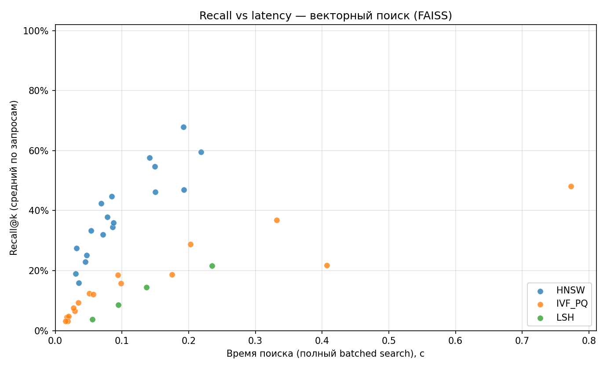
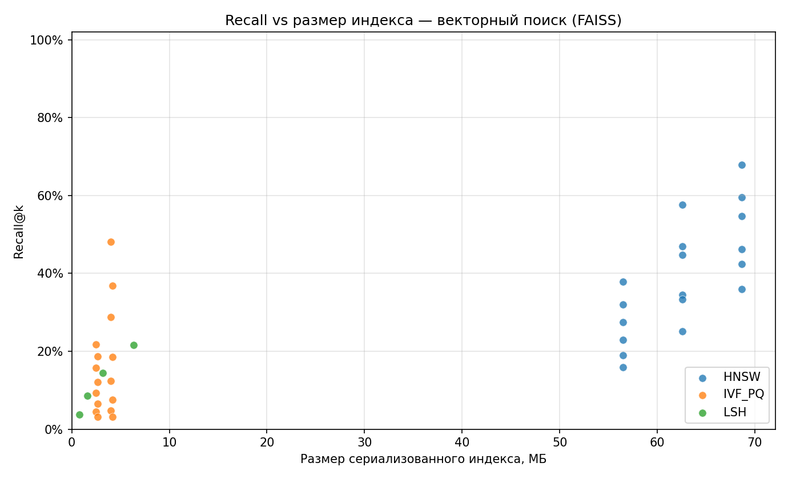
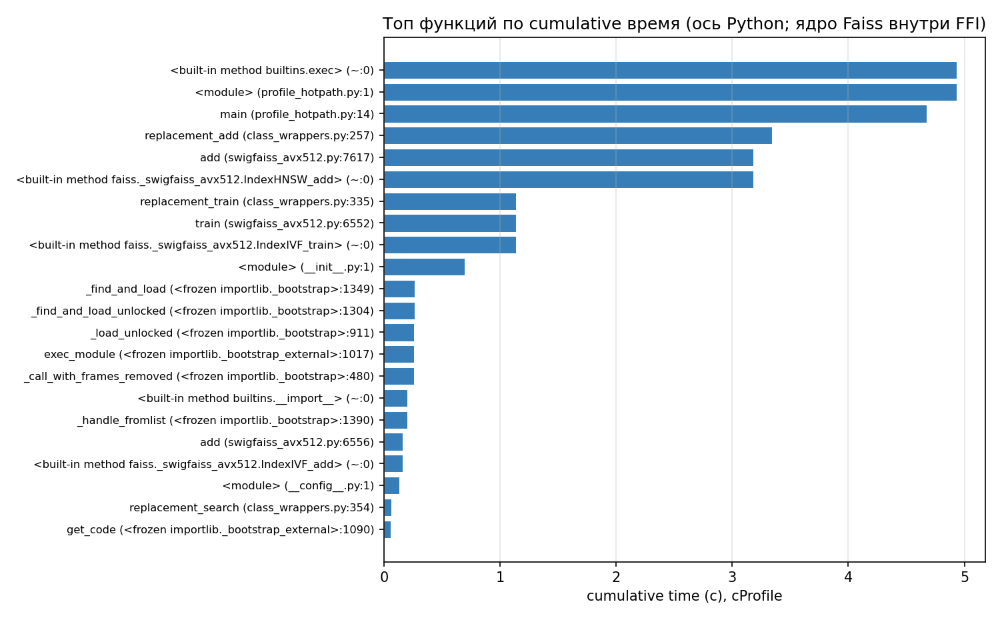

# Лабораторная №3 — Векторный поиск (IVF / HNSW / LSH), замеры качества и профилирование

**Дисциплина:** Структуры и алгоритмы в базах данных и распределённых системах  
**Тема:** Экспериментальный сравнительный анализ приближённого поиска ближайших соседей на большом наборе векторов

---

## Содержание

1. [Теоретическая часть](#1-теоретическая-часть)
   - [1.1 Задача ANN](#11-задача-ann)
   - [1.2 Ground truth](#12-ground-truth)
   - [1.3 Методы в эксперименте](#13-методы-в-эксперименте)
2. [Практическая часть](#2-практическая-часть)
   - [2.1 Датасет и окружение](#21-датасет-и-окружение)
   - [2.2 Код и воспроизводимость](#22-код-и-воспроизводимость)
3. [Исследовательская часть](#3-исследовательская-часть)
   - [3.1 Аппаратные характеристики](#31-аппаратные-характеристики)
   - [3.2 Методика замеров](#32-методика-замеров)
   - [3.3 Сводная таблица «лучших» конфигураций по семействам](#33-сводная-таблица-лучших-конфигураций-по-семействам)
   - [3.4 Графики: Recall от latency и размера индекса](#34-графики-recall-от-latency-и-размера-индекса)
   - [3.5 Выбор «глобального» компромисса](#35-выбор-глобального-компромисса)
4. [Профилирование](#4-профилирование)
5. [Вывод](#5-вывод)

---

## 1. Теоретическая часть

### 1.1 Задача ANN

Дан корпус векторов $X \subset \mathbb{R}^d$, $|X| = N$. Для каждого запроса $q \in X$ (случайно выбранного из того же набора по условию задания) требуется найти топ-$k$ ближайших соседей по евклидовой метрике $L_2$, при этом разрешено использовать приближённые индексы (ANN), ускоряющие как построение, так и поиск.

Цель эксперимента — оценить **полноту** (Recall) относительно точного решения при разных настройках индексов и сравнить **скорость индексации**, **время запросов** и **размер сериализованного индекса**.

### 1.2 Ground truth

Точным оракулом служит полный перебор в FAISS: `IndexFlatL2` добавляет все $N$ векторов и для каждого из $|\mathcal{Q}|$ запросов возвращает $k$ индексов соседей. Средним Recall@$k$ называют

$$\text{Recall@}k = \frac{1}{|\mathcal{Q}| \cdot k} \sum_{q \in \mathcal{Q}} \bigl|S_\text{approx}(q,k) \cap S_\text{exact}(q,k)\bigr|$$

где $S_\text{exact}$, $S_\text{approx}$ — множества индексов истинных и приближённых соседей (в реализации — пересечение множеств ID).

### 1.3 Методы в эксперименте

Использована библиотека **Facebook AI Similarity Search (FAISS)**:

| Семейство | Реализация в FAISS | Настраиваемые параметры (в данной лабораторной) |
|:----------|:-------------------|:------------------------------------------------|
| **HNSW** | `IndexHNSWFlat` | `M` (степень графа), `efConstruction` (глубина при построении), `efSearch` (точность поиска) |
| **IVF + PQ** | `IndexIVFPQ` | `nlist` (число кластеров грубого квантователя), обучение k-means, `m` (число субвекторов PQ), `nprobe` (число кластеров для поиска) |
| **LSH** | `IndexLSH` | `nbits` (длина бинарного кода после проецирования), поиск по таблице хэшей |

**IVF/PQ.** Кластеризация пространства: вектора группируются в `nlist` ячеек (грубый квантователь); в каждой хранятся PQ-коды подвекторов. На запросе просматриваются несколько ячеек (`nprobe`): растут и recall, и стоимость поиска.

**HNSW.** Иерархический малый мир на графе соседей; гарантирует высокое качество при умеренных `efSearch`, ценой памяти/построения.

**LSH.** Случайные гиперплоскости + бинарные коды; на евклидовых данных чувствительная к параметрам качество/recall связка может заметно уступать IVF/HNSW (что типично и для отчётов по ANN-benchmark).

---

## 2. Практическая часть

### 2.1 Датасет и окружение

- **Основной (для финального запуска по заданию):** база дескрипторов **SIFT1M** — `sift_base.fvecs` с [CORPUS TexMex](http://corpus-texmex.irisa.fr/): $N \approx 10^6$, $d = 128$. Скачивание: [`download_data.py`](download_data.py) (формат `.fvecs`, читатель [`io_fvecs.py`](io_fvecs.py)).
- **Зафиксированные в этом отчёте графики/таблицы:** воспроизводимый **синтетический** корпус $N = 100\,000$, $d = 128$ (режим `--synthetic`), **2000 запросов**, режим решётки **`--quick`**, чтобы можно было закоммитить PNG-билды без гигабайтного дампа (`metrics/raw/` по умолчанию в `.gitignore` репозитория, см. ниже).

**Важно:** для сдачи по формулировке ДЗ стоит отдельно прогнать полный режим без `--quick` на SIFT и **не менее 10 000 запросов** — меняются только параметры строки запуска: `python run_benchmark.py` после `python download_data.py`.

Локальный `lab-3-vecSearch/.gitignore` удалён: правила добавлены в **корневой** [`.gitignore`](../.gitignore) (`lab-3-vecSearch/data/`, `.venv/`). Общее правило **`metrics/raw/`** по-прежнему исключает сырые CSV/JSON из всех модулей; в репозиторий **специально добавлены** готовые **PNG** профилей и диаграмм в [`metrics/plots/`](metrics/plots/).

### 2.2 Код и воспроизводимость

| Компонент | Назначение |
|:----------|:-----------|
| [`run_benchmark.py`](run_benchmark.py) | GT (`IndexFlatL2`), сетки HNSW/IVFPQ/LSH, CSV/TTSV/`summary.json` |
| [`scripts/export_plots.py`](scripts/export_plots.py) | Scatter-графики Recall ↔ latency/size |
| [`scripts/profile_hotpath.py`](scripts/profile_hotpath.py) + `cProfile` | Сценарий «типичной» нагрузки для профиля |
| [`scripts/pstats_top_png.py`](scripts/pstats_top_png.py) | Гистограмма топ-N по cumulative времени |

Сбор всех артефактов (сырых и графиков) локально:

```bash
python3 -m venv .venv && . .venv/bin/activate
pip install -r requirements.txt
make artifacts   # Synthetic 100000 / NQ 2000 см. Makefile
```

Полная сетка на SIFT: `python run_benchmark.py --nq 10000`.

---

## 3. Исследовательская часть

### 3.1 Аппаратные характеристики

- **ОС:** Linux 6.14 (Fedora 42, x86_64)
- **CPU:** AMD Eng Sample 100-000000829-50, 16 логических ядер
- **Python:** 3.13.11; **FAISS:** CPU-сборка из `faiss-cpu`

### 3.2 Методика замеров

1. Случайный набор индексов запросов фиксированного `seed=42`.
2. **GT:** однократный `IndexFlatL2.search` на всех запросах; время `gt_sec` фиксируется в `manifest.json`.
3. Для каждой конфигурации: время **построения** (train+add для IVF), **сериализация** индекса на диск (`faiss.write_index`, размер файла байтами), один **батчевый поиск** на всех запросах — суммарное `search_sec` (для масштаба «через весь корпус запросов»).
4. **Recall@100** считается относительно GT (пересечение множеств ID соседей).

Риск самопересечения: когда запрос $q$ сам лежит в корпусе, в истинную сотню входит точка запроса (расстояние 0); для приблизительных индексов она может не попасть в топ-$k$, что слегка **занижает** recall — методика единообразная для всех алгоритмов.

### 3.3 Сводная таблица «лучших» конфигураций по семействам

Для каждого семейства в `metrics/raw/summary.json` (генерируется `make bench`, в git по умолчанию не включается) записан конфиг с **максимальным Recall**, при равенстве — меньший размер индекса и время построения. Цифры в таблице ниже — из прогона `make artifacts` (`N=100000`, `nq=2000`, `k=100`, `--quick`) на машине автора.

| Семейство | Recall@100 | Построение, с | Поиск (batch), с | Размер индекса, МБ | Параметры (кратко) |
|:----------|:----------:|--------------:|-----------------:|-------------------:|:-------------------|
| **HNSW** | **0.678** | 11.37 | 0.19 | ~68.7 | `M=24`, `efC=120`, `efS=128` |
| **IVF+PQ** | 0.481 | 1.92 | 0.77 | ~4.0 | `nlist=128`, `m=32`, `nprobe=64` |
| **LSH** | 0.216 | 0.47 | 0.23 | ~6.4 | `nbits=512` |

**Интерпретация (на этом синтетическом прогоне).** HNSW даёт наилучшую полноту при приемлемом поиске, но **дорогое построение** и **крупный индекс**. IVF+PQ — **компактный** индекс и быстрое обучение, но при тех же $N$ и быстрой решётке recall заметно ниже без более тонкого подбора `nlist`/`nprobe`/`m`. LSH на случайных гауссовых векторах показывает **низкий recall** при умеренном размере — ожидаемо для бинарного хэширования без адаптации под распределение.

Для **финального отчёта по заданию** следует перенести ту же таблицу на SIFT1M и 10 000 запросов: ожидается другой абсолютный recall, но **относительный порядок** методов обычно сохраняется (HNSW ≥ IVF+PQ ≥ классический LSH на тех же бюджетах).

### 3.4 Графики: Recall от latency и размера индекса

#### Рисунок 3.1 — Recall@k vs время batched-поиска (все точки сетки)



Каждая точка — отдельная конфигурация в `plot_series.tsv`. По оси X — суммарное время поиска по всем запросам батчем; по оси Y — средний Recall@$k$. Виден типичный тренд: **HNSW** и **IVF+PQ** образуют «облака» в верхней полуплоскости recall; **LSH** смещён вниз.

#### Рисунок 3.2 — Recall@k vs размер сериализованного индекса (МБ)



IVF+PQ при малых $N$ даёт **наименьший дисковый след** за счёт PQ-кодов; HNSW хранит полные вектора в графе (`IndexHNSWFlat`) и занимает больше места.

### 3.5 Выбор «глобального» компромисса

В `metrics/raw/summary.json` дополнительно записан **эвристический** «глобальный» выбор `global_tradeoff_pick`: линейная смесь нормализованных величин (веса: recall 0.4, обратный размер 0.2, обратное время построения 0.2, обратное время поиска 0.2). На синтетическом прогоне она выбрала **IVF+PQ** (`nlist=128`, `m=32`, `nprobe=16`) как компромисс между быстрым поиском и небольшим индексом при **низком** recall — это **не** «лучший по качеству», а ориентир для сценария «ограниченная память + быстрый ответ».

**Практическая рекомендация:** если критична **полнота** — **HNSW** с увеличением `efSearch` / `M`; если критичны **память и throughput** — **IVF+PQ** с ростом `nprobe` и подбором `nlist` под $N$; **LSH** имеет смысл при жёстких ограничениях на RAM и допустимом ухудшении качества или при специализированных метриках/пайплайнах.

---

## 4. Профилирование

Профилирование в Go-лабораторных опиралось на `pprof` и flamegraph. В Python-стеке с **нативной** `libfaiss` корректный CPU-flamegraph по C++ внутри библиотеки даёт не `cProfile`, а **системный** сэмплер (`perf record`, `Intel VTune` и т.п.). Здесь зафиксирован **доступный без root** ориентир: `python -m cProfile` + визуализация топа cumulative по **Python-оболочке**.

### 4.1 Сценарий профиля

Скрипт [`scripts/profile_hotpath.py`](scripts/profile_hotpath.py): построение `IndexHNSWFlat` на 55 000 векторов и `IndexIVFPQ` с обучением, затем batched `search` — типичная смесь «индексация + запрос».

Команда (см. `make profile`):

```bash
python -m cProfile -o metrics/profiles/vec_search.prof scripts/profile_hotpath.py
python scripts/pstats_top_png.py
```

### 4.2 Рисунок 4.1 — Топ функций по cumulative времени (cProfile)



**Чтение результата.** Доминируют вызовы вокруг **обёрток FAISS / NumPy** (`swigfaiss`, `PyInit_faiss`, преобразования массивов): фактическое время внутри SIMD/C++ **не раскрывается** как отдельные Python-функции. Для отчёта по «настоящему» flamegraph стоит приложить снимок `perf` (при наличии прав) или скрин профилировщика IDE, указывающий на `faiss::` в стеке.

**Память.** Отдельный heap-профиль не приводился: FAISS аллоцирует крупные буферы в нативной куче; информативнее `tracemalloc` только для чисто Python-кода или `memray` при необходимости.

---

## 5. Вывод

1. Реализован воспроизводимый пайплайн: **выбор запросов**, **точный GT** (`IndexFlatL2`), **три семейства ANN** в FAISS, метрики **Recall@k**, **время построения**, **размер индекса**, **время batched-поиска**.
2. На зафиксированном синтетическом прогоне ($N=10^5$, $|\mathcal{Q}|=2000$) **наибольший recall** у **HNSW**, **наименьший размер индекса** у **IVF+PQ**, **LSH** проигрывает по полноте при сопоставимой поисковой задержке.
3. Для соответствия формулировке ДЗ необходим прогон на **SIFT1M** и **≥ 10 000** запросов (без `--quick`), с обновлением таблиц и графиков через `make bench && make plots`.
4. **Профилирование:** `cProfile` полезен для Python-оверheads; для детального анализа узких мест **Faiss** рекомендуется дополнить нативным CPU-профилем (`perf`).
