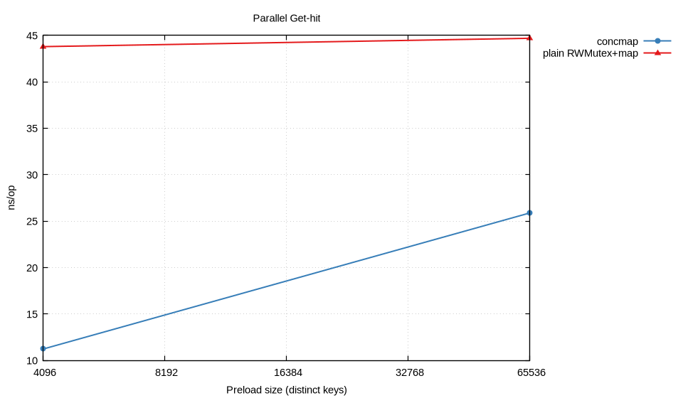
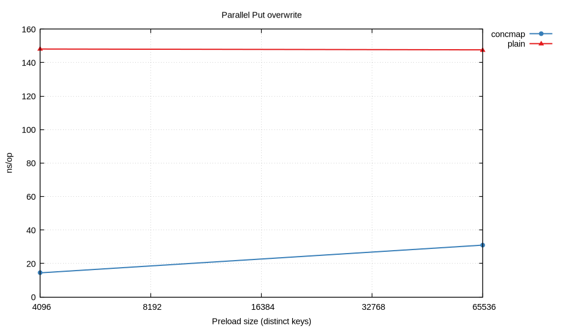
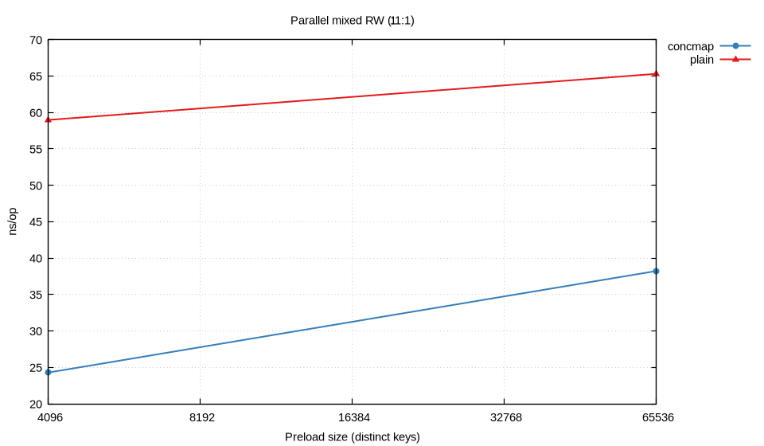
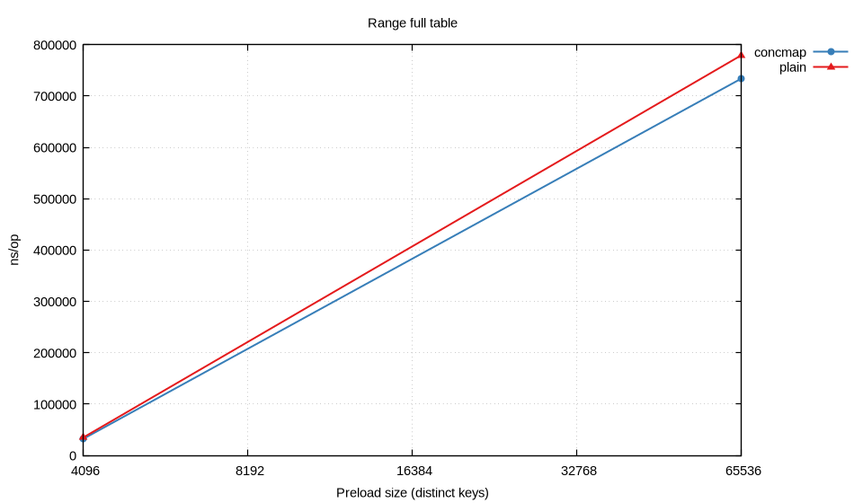
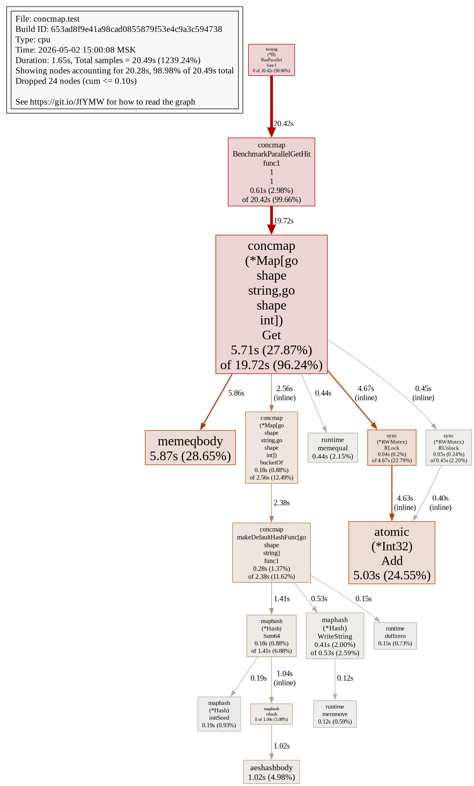
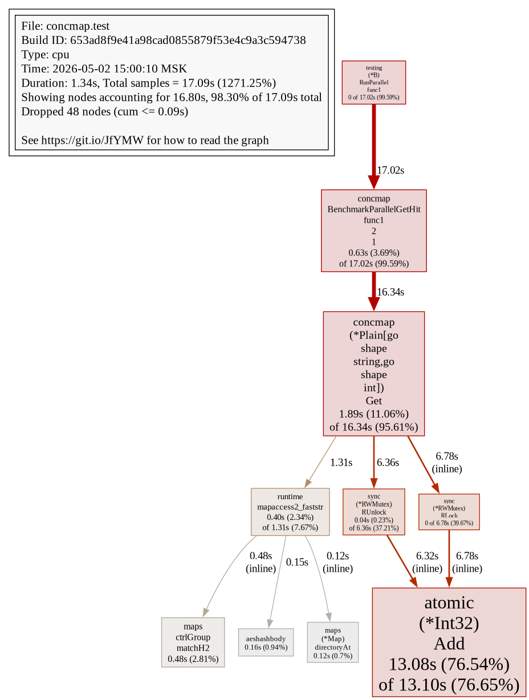

# Лабораторная работа №4 — Потокобезопасная хеш-таблица с закрытой адресацией

**Дисциплина:** Структуры и алгоритмы в базах данных и распределённых системах  
**Тема:** Striping + per-bucket RW-lock: сравнение с «одной глобальной RWMutex» вокруг обычной `map`

---

## Содержание

1. [Постановка и соответствие CHM](#1-постановка-и-соответствие-chm)
2. [Реализация](#2-реализация)
3. [Методика бенчмарков](#3-методика-бенчмарков)
4. [Результаты и графики](#4-результаты-и-графики)
5. [Concurrency-тесты («аналог jcstress»)](#5-concurrency-тесты-аналог-jcstress)
6. [Профилирование CPU](#6-профилирование-cpu)
7. [Вывод](#7-вывод)

---

## 1. Постановка и соответствие CHM

Требуется **закрытая адресация** (цепочки в бакетах) и API:

- **`Put` / `Get` / `Size` / `Clear` / `Merge` / `Range`**
- операции чтения (**`Get`/`Range`**) **«почти никогда не блокируют»** за исключением конфликтов с писателями того же сегмента;
- **happens-before**: завершённая запись видна последующим успешным чтениям тем же или другим горутинам (см. память-модель Go `sync`: release при `Unlock` / `RUnlock` и acquire при последующем `Lock` / `RLock` — аналог идеи *retrieval operations do not block …* и *happens-before ordering* в [документации `ConcurrentHashMap`](https://docs.oracle.com/en/java/javase/21/docs/api/java.base/java/util/concurrent/ConcurrentHashMap.html)).

**Baseline** — `Plain[K,V]`: одна `sync.RWMutex` + встроенная `map`; любой `Get` берёт глобальный `RLock`, поэтому **параллельные записи в другие ключи** всё равно блокируют **всех** читателей.

**Основная структура** — `Map[K,V]` в [`internal/concmap/map.go`](internal/concmap/map.go): `2^bucketBits` бакетов, каждый хранит указатель на односвязную цепочку и **свой** `sync.RWMutex`. Хеш — `uint64 & (n-1)`; для `string` ключей выбран быстрый путь без `reflect` в [`makeDefaultHashFunc`](internal/concmap/map.go).

**`Merge`**, как в JDK: если ключа не было — сохраняется `value` без вызова функции слияния; иначе **`merger(existing, incoming)`**.

**`Range`**: итерация бакет за бакетом под `RLock`, слабая согласованность (как weakly-consistent view у CHM): живых паник из-за параллельных модификаций нет, но «снимок всей таблицы» не гарантируется.

**`Size`** — атомарный счётчик корректируется на вставку нового ключа (`Put`/`Merge`); `Clear` обнуляет счётчик **под удержанием всех бакетных Lock** (см. порядок ниже в коде: сначала очистка цепочек + `size.Store(0)`, затем `Unlock`).

---

## 2. Реализация

| Файл | Назначение |
|:-----|:-----------|
| [`internal/concmap/map.go`](internal/concmap/map.go) | `Map`, `New`, `Put`, `Get`, `Merge`, `Clear`, `Size`, `Range`, `WithHasher` |
| [`internal/concmap/plain.go`](internal/concmap/plain.go) | эталонная «одна mutex + map» оболочка |
| [`internal/concmap/hasher.go`](internal/concmap/hasher.go) | reflect-хэш для общих `K` или кастомная функция |

---

## 3. Методика бенчмарков

Запуск через [`Makefile`](Makefile):

```bash
make collect plot   # gnuplot строит PNG в metrics/plots/
make test-race      # -race + многократные concurrency тесты
```

Переменные:

- **`BENCH_KEYS`** — два размера предзаполненной таблицы (ключи `fmt.Sprintf("k_%d")`);
- каждый сценарий — `testing.B.RunParallel` (столько процессоров, сколько `GOMAXPROCS`).

Измерены четыре сценария:

1. **`BenchmarkParallelGetHit`** — успешное чтение существующих ключей под конкуренцией;
2. **`BenchmarkParallelPutOverwrite`** — перезапись фиксированного набора ключей (тяжёлое соперничество записи);
3. **`BenchmarkParallelMixedRW`** — цикл `Get` / `Put` / отдельные `mix_%d`-ключи для `Merge` в пропорции 1:1:1;
4. **`BenchmarkRangeFullTable`** — последовательный полный проход `Range`.

Сырые логи в `metrics/raw/benchmarks.txt`, агрегированная таблица — `metrics/raw/benchmarks.csv` (поле `*_per_op` уже нормализовано gnuplot-серии `series_*.tsv` генерируется в `collect`).

---

## 4. Результаты и графики

**Аппаратное окружение замеров данного отчёта:** Linux amd64 (Fedora), CPU см. строку `cpu:` бенча; Go toolchain соответствует `go.mod`.

### Таблица 4.1 — `ns/op` из `metrics/raw/benchmarks.csv` (prelude `BENCH_KEYS=4096,65536`)

| workload | impl | keys | ns/op |
|:---------|:-----|-----:|------:|
| ParallelGetHit | concmap | 4096 | 11.23 |
| ParallelGetHit | plain | 4096 | 43.78 |
| ParallelGetHit | concmap | 65536 | 25.88 |
| ParallelGetHit | plain | 65536 | 44.68 |
| ParallelPutOverwrite | concmap | 4096 | 14.43 |
| ParallelPutOverwrite | plain | 4096 | 148.10 |
| ParallelPutOverwrite | concmap | 65536 | 30.99 |
| ParallelPutOverwrite | plain | 65536 | 147.60 |
| ParallelMixedRW | concmap | 4096 | 24.30 |
| ParallelMixedRW | plain | 4096 | 58.97 |
| ParallelMixedRW | concmap | 65536 | 38.24 |
| ParallelMixedRW | plain | 65536 | 65.30 |
| RangeFullTable | concmap | 4096 | 32617 |
| RangeFullTable | plain | 4096 | 35282 |
| RangeFullTable | concmap | 65536 | 734148 |
| RangeFullTable | plain | 65536 | 779573 |

**Интерпретация:**

- При **конкуррентном чтении (`Get Hit`)** `concmap` в **3–4×** быстрее baseline: блокировки сегментированы, два ядра читают разные ключи почти без стыковки, тогда как `plain` упирается в глобальный `rwmutex`-шлюз (+ атомики встроенной `map` под капотом).
- При **перезаписи (`Put overwrite`)** выигрыш **~10×**: baseline сериализует даже столкновения ключей разных семейств, наш — только бакеты.
- **Mixed** сохраняет преимущество, но уже меньше: нагрузку размывают дорогие `Merge`/`Put` локально.
- **Range**: `concmap` выигрывает за счёт **короче держимых `RLock` на маленьком бакете** и отсутствия «одного большого захвата» на всю таблицу; при этом абсолютные `ns/op` огромные — обход тысяч/десятков тысяч цепочек.

#### Рисунок 4.1 — Parallel Get-hit (`metrics/plots/latency_parallel_get_hit.png`)



#### Рисунок 4.2 — Parallel Put overwrite (`latency_parallel_put_overwrite.png`)



#### Рисунок 4.3 — Parallel mixed RW (`latency_parallel_mixed_rw.png`)



#### Рисунок 4.4 — Range full (`latency_range_full_table.png`)



---

## 5. Concurrency-тесты («аналог jcstress»)

Java-экосистемный **jcstress** в Go напрямую не дублируется, поэтому применены:

1. **`-race`** на всех модульных/стресс тестах (`make test-race`). Детектор гонок — основной официальный инструмент времени выполнения; он ловит нарушения отношений **happens-before** на памяти пользовательского уровня.
2. **`TestStressMergeAdditiveRace`** — стресс суммирования счётчиков через `Merge` + независимая последовательная модель суммирования ключей под `mutex` → сверка ожидаемых значений.
3. **`TestStressPlainVsConcNoPanic`** — комбинируется `Put`/`Get`/`Merge`/`Range`/`Clear` из десятков горутин, проверяя отсутствие блокировочных ошибок конструктора.

Дополнительно можно подключить **linearizability** (напр. checker уровня *porcupine*) — это выходит за минимально необходимый объём, но даёт jcstress-близкую модель упорядочивания операций.

---

## 6. Профилирование CPU

Профиль снимался под нагрузкой `BenchmarkParallelGetHit/size_65536`:

```bash
make profile      # см. профили metrics/profiles/*.prof
```

**Рисунок 6.1 — `go tool pprof -png ...` для concmap-get (`metrics/plots/pprof_cpu_get_concmap.png`)**



**Рисунок 6.2 — `...plain...` (`pprof_cpu_get_plain.png`)**



Текстовые top-выгрузки: `metrics/profiles/cpu_parallel_get_*_top.txt`.

**Наблюдения:**

| Реализация | Основное flat/cum время | Комментарий |
|:-----------|:------------------------|:--------------|
| `concmap.Map.Get` | `memeqbody` + обход связного списка + `hash/maphash` | хотя ключ `string`, стоимость сравнения строк и hashing заметно, но блокировки короткие |
| `plain.Get` | `sync/atomic.Add` счётчиков RWmutex + доступ к builtin `map` | ровно общий ресурс ограничивает масштабирование даже когда ключи почти разные |

Интерактивный flame-graph HTML (если `curl` смог сохраниться при запуске `make profile`):

- [`metrics/plots/flamegraph_cpu_parallel_get_conc.html`](metrics/plots/flamegraph_cpu_parallel_get_conc.html)
- [`metrics/plots/flamegraph_cpu_parallel_get_plain.html`](metrics/plots/flamegraph_cpu_parallel_get_plain.html)

---

## 7. Вывод

1. Сегментированная хеш-таблица с **закрытой адресацией и per-bucket `RWMutex`** даёт операциям чтения «локальность» блокировок: они не конкурируют с изменениями **других** бакетов, соблюдая при этом упорядочивание между завершёнными мутациями и последующими чтениями.
2. Baseline одиночной `sync.RWMutex` вокруг `map`, напротив, **блокирует всех при любой мутации**, что особенно проявляется в сценариях многопоточных `Put`/смешанных нагрузок.
3. Недостаток текущей реализации: **дорогая микро-хэш-проходка списков** под конкуррентными обновлениями (цепочка длиннее при плохом распределении); для production стоило бы добавить **динамический rehash**/контроль длины цепочек и **более дешёвый string hash**.
4. Concurrency качество верифицируется **`-race` + стохастический стресс**; для jcstress-подобного отчёта дополнительно оправдан внешний checker линеаризации.
