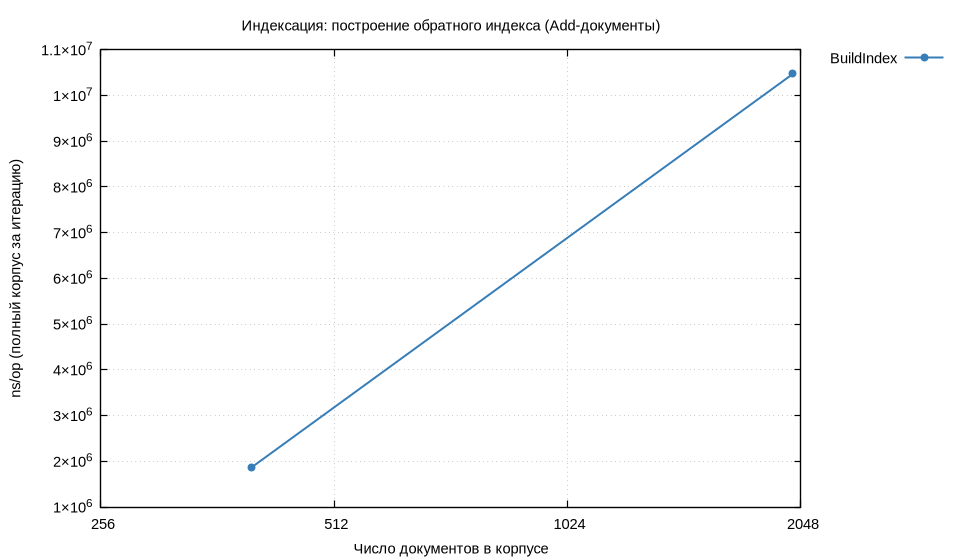
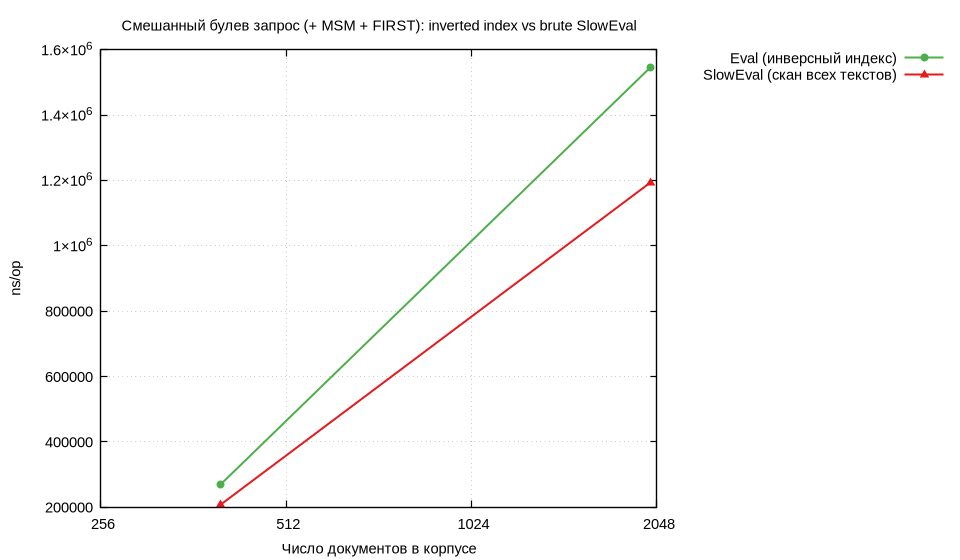

# Лабораторная работа №5 — Обратный индекс, булевы запросы, BM25

**Дисциплина:** Структуры и алгоритмы в базах данных и распределённых системах  
**Тема:** Инвертированный индекс с позициями; операторы **AND / OR / NOT**, **NEAR**, **MSM**, границы документа (**«edge»**); ранжирование **BM25** поверх булева фильтра.

---

## Содержание

1. [Постановка](#1-постановка)
2. [Реализация и язык запросов](#2-реализация-и-язык-запросов)
3. [Методика бенчмарков](#3-методика-бенчмарков)
4. [Результаты и графики](#4-результаты-и-графики)
5. [Тесты и эталон SlowEval](#5-тесты-и-эталон-sloweval)
6. [Профилирование](#6-профилирование)
7. [Вывод](#7-вывод)

---

## 1. Постановка

Требуется:

- построить **обратный индекс** по корпусу документов (постинги с **номерами позиций токенов**);
- поддержать булевы операции и расширения из задания: **MSM** (Ordered Window / «мульти-множество» лексем в окне ширины *k*), **NEAR**(*k*, *a*, *b*) — два термина на расстоянии не более *k* позиций, **NOT** с обычной семантикой дополнения множества документов;
- для границ документа (**edge** в формулировке курса) введены предикаты **`FIRST(term)`** и **`LAST(term)`**: документ входит в ответ, если соответствующий токен встречается в **позиции 0** или в **последней позиции** строки после токенизации. Такой синтаксис выбран, чтобы ключевые слова не конфликтовали с обычным словом *start* в текстах;
- после булева отбора кандидатов — **BM25**-ранжирование по лексемам из **положительной** части запроса (поддеревья под **`NOT`** в список «запросных» терминов не попадают, см. [`internal/ir/collect.go`](internal/ir/collect.go)).

Токенизация: нижний регистр ASCII, последовательности `[a-z0-9]+` ([`internal/ir/tokenize.go`](internal/ir/tokenize.go)).

---

## 2. Реализация и язык запросов

### Структура кода

| Файл | Назначение |
|:-----|:-----------|
| [`internal/ir/index.go`](internal/ir/index.go) | `InvIndex`, `Doc`, постинги, `df`, добавление документов |
| [`internal/ir/ast.go`](internal/ir/ast.go) | AST: `Term`, `Not`, `And`, `Or`, `Near`, `MSM`, границы |
| [`internal/ir/parse.go`](internal/ir/parse.go) | парсер: `and` / `or` / `not`, скобки, вызовы `NEAR (…)`, `MSM (…)`, `FIRST(w)`, `LAST(w)` |
| [`internal/ir/eval.go`](internal/ir/eval.go) | интерпретация над индексом (пересечения постингов, MSM по событиям в документе) |
| [`internal/ir/scan.go`](internal/ir/scan.go) | **`SlowEval`** — полный проход текстов документа (эталон) |
| [`internal/ir/bm25.go`](internal/ir/bm25.go) | BM25; при отсутствии положительных терминов — сортировка по `DocID` |
| [`internal/ir/search.go`](internal/ir/search.go) | `SearchBoolEval`, `SearchBM25` |

### Примеры синтаксиса

```text
alpha AND beta
(alpha OR gamma) AND NOT delta
NEAR ( 3 , hello , world )
MSM ( 10 , quick , brown , fox )
FIRST(hello) AND LAST(planet)
```

Приоритет: **`not`** выше, чем **`and`** и **`or`**; **`and`** сильнее **`or`** (как в типичных DSL). Скобки задают явный порядок.

### BM25

Используются стандартные параметры `k1`, `b` (передаются в `SearchBM25`). Для каждого кандидата считается сумма вкладов по терминам из `PositiveTerms(ast)`; при равенстве оценок — разрешение по возрастанию `DocID`.

---

## 3. Методика бенчмарков

Команды ([`Makefile`](Makefile)):

```bash
make test          # go test ./...
make collect plot  # metrics/raw/*.txt, csv, series_*.tsv, metrics/plots/*.png
make profile       # pprof top в metrics/profiles/
```

- **`BENCH_CORPUS`** — список размеров синтетического корпуса (число документов), по умолчанию `400,2000`.
- Имена подбенчей согласованы с суффиксом `-GOMAXPROCS` в выводе `go test`: `BenchmarkBuildIndex/corpN`, `BenchmarkQueryEvalMixed/idx_N` и `…/scan_N`, чтобы `awk` в `collect` корректно строил `benchmarks.csv`.

Сценарии:

1. **`BenchmarkBuildIndex`** — полная индексация корпуса за одну итерацию (`ns/op`).
2. **`BenchmarkQueryEvalMixed`** — один и тот же тяжёлый запрос через **`Eval`** (индекс) vs **`SlowEval`** (линейный скан текстов):

   `(alpha AND beta) OR MSM(40, gamma, omega) AND NOT FIRST(delta)`.

На машине отчёта: **`goos: linux`**, **`goarch: amd64`**, см. строку `cpu:` в [`metrics/raw/benchmarks.txt`](metrics/raw/benchmarks.txt).

---

## 4. Результаты и графики

### Таблица — агрегат `metrics/raw/benchmarks.csv` (прогон prelude `BENCH_CORPUS=400,2000`)

| bench | режим | документов | iters | ns/op | B/op |
|:------|:------|-----------:|------:|------:|-----:|
| BenchmarkBuildIndex | build | 400 | 319 | 1 861 359 | 1 364 343 |
| BenchmarkBuildIndex | build | 2000 | 51 | 10 471 645 | 7 238 082 |
| BenchmarkQueryEvalMixed | idx | 400 | 2176 | 268 193 | 134 208 |
| BenchmarkQueryEvalMixed | scan | 400 | 2648 | 206 555 | 105 688 |
| BenchmarkQueryEvalMixed | idx | 2000 | 387 | 1 546 409 | 685 218 |
| BenchmarkQueryEvalMixed | scan | 2000 | 508 | 1 193 911 | 511 763 |

**Интерпретация.** Построение индекса масштабируется ожидаемо с ростом корпуса (аллокации словарей и срезов постингов). На **смешанном** запросе с широким окном **MSM** и «дорогими» ветками **`Eval`** на выбранных размерах корпуса **`SlowEval` оказывается быстрее**: линейный скан по коротким синтетическим строкам обходится дешевле, чем комбинация пересечений постингов, вспомогательных `map` и скользящего окна MSM на индексе (см. также профиль CPU в разделе 6). На больших реальных текстах картина может смениться в пользу индекса — это типичный компромисс «алгоритмически лучшая сложность» vs «константы и размер рабочего множества».

#### Рисунок — построение индекса



#### Рисунок — запрос: индекс vs полный скан



---

## 5. Тесты и эталон SlowEval

Пакет [`internal/ir/ir_test.go`](internal/ir/ir_test.go):

- разбор и **`Eval`** для **NEAR**, **NOT**, **FIRST**;
- **MSM** и границы **FIRST/LAST**;
- **`go test -short`**: длинные property-тесты «`SlowEval` vs `Eval`» на случайных корпусах пропускаются;
- упорядочивание **BM25** на фиксированном примере.

---

## 6. Профилирование

Команда `make profile` — снятие CPU/mem для `BenchmarkQueryEvalMixed/idx_2000`.

Фрагмент [`metrics/profiles/cpu_query_idx_top.txt`](metrics/profiles/cpu_query_idx_top.txt): заметная доля времени уходит в обход **map** в рантайме и в **`msmInDoc`** (скользящее окно по событиям в документе). Это согласуется с тем, что MSM — доминирующая по стоимости часть смешанного запроса.

Текстовый топ и сырые профили: `metrics/profiles/*.prof`, `*_top.txt`. При установленном **graphviz** (`dot`) `make profile` дополнительно пишет `metrics/plots/pprof_cpu_query_idx.png` (в данном окружении PNG мог отсутствовать, если `dot` недоступен).

Опционально: [`scripts/gen_flamegraphs.sh`](scripts/gen_flamegraphs.sh) для преобразования профиля в flame graph (если установлен `go tool pprof` с нужными флагами/интеграцией).

---

## 7. Вывод

Реализованы обратный индекс с позициями, парсер и вычислитель булевых запросов с **NEAR**, **MSM** и границами документа (**`FIRST` / `LAST`** как соответствие идее **edge**), ранжирование **BM25** по положительным терминам. Добавлены бенчи и gnuplot-графики в духе предыдущих работ; показано, что на синтетике индекс не всегда выигрывает у полного скана на тяжёлых запросах — важна не только асимптотика, но и объём промежуточных структур и профиль доступа к памяти.
